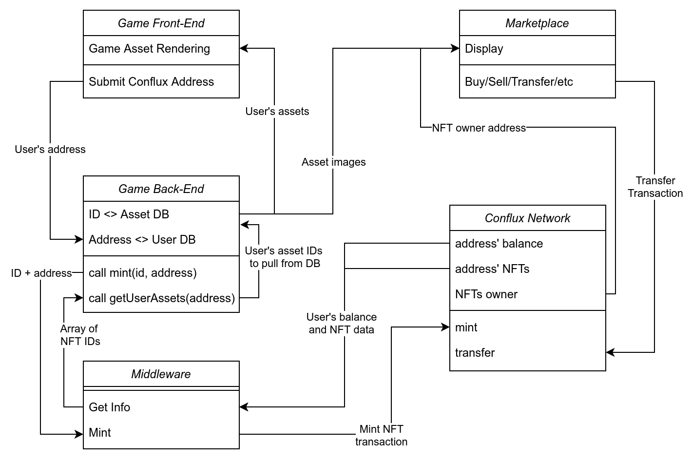

# Sponsored ERC721

Repository for the basic tools in javascript and golang for integrating Conflux Network NFTs (ERC-721) into applications. The following details how to mint, get address NFT ids, and set up transaction sponsorship (optional).



The above illustrates a basic PoC of integrating NFTs into a game. The game only need to track the user's address in their account. The backend needs to interface with the Conflux Network blockchain to send/mint assets for each user, and also retrieve data. The marketplace for trading assets can be handled by third-party marketplaces that aggregate NFTs/game assets from any game - which is the unique functionality that blockchain enables: cross-game assets.

This repository details the middleware layer of providing easy to use/integrate functions for games to connect NFTs to a game.

## Contract
ERC721 Contract from [OpenZeppelin](https://docs.openzeppelin.com/contracts/3.x/)
* Compiled using conflux-truffle (`cfxtruffle compile`)
* ABI/bytecode used for deployment

## Deploy
Javascript files for deploying NFT contract and setting up transaction sponsorship.

Function | Details
--|--
`node deploy <KEY_ENV>` | Deploy the corresponding ERC721 contract to Conflux testnet
`node sponsor <KEY_ENV> <CONTRACT_ADDR>`| Send CFX as sponsor for gas and collateral
`node checkSponsor <CONTRACT_ADDR>` | Check sponsorship parameters of contract address
`node addSponsored <KEY_ENV> <CONTRACT_ADDR> <SPONSORED_ADDR>` | Admin can add an address as a sponsored address for smart contract interaction
`node isSponsered <CONTRACT_ADDR> <USER_ADDR>` | Check if user is sponsored for the smart contract
`node destroy <KEY_ENV> <CONTRACT_ADDR>` | Destroy the contract and unstake storage collateral (only contract admin can call)


#### Example
Sample `.env` file:
```
ENDPOINT=http://test.confluxrpc.org
PRIVATE_KEY1=0x<private_key>
PRIVATE_KEY2=0x<private_key>
```

Sample function calls:
```
//for deploying contract
node deploy PRIVATE_KEY1
node sponsor PRIVATE_KEY2 0x8aa092e0660c59eab456efdbd39ae8d158e9a95b
node checkSponsor 0x8aa092e0660c59eab456efdbd39ae8d158e9a95b
node addSponsored PRIVATE_KEY1 0x8aa092e0660c59eab456efdbd39ae8d158e9a95b 0x15fd1E4F13502b1a8BE110F100EC001d0270552d
node isSponsored 0x8aa092e0660c59eab456efdbd39ae8d158e9a95b 0x15fd1E4F13502b1a8BE110F100EC001d0270552d

//for destroying contract
node destroy PRIVATE_KEY1 0x8aa092e0660c59eab456efdbd39ae8d158e9a95b
```
Note: `PRIVATE_KEY1` is the creator of the contract and is the default admin, so it is used in the `addSponsored` command. `PRIVATE_KEY2` is used to represent any sponsor.

Contract address (testnet): 0x8aa092e0660c59eab456efdbd39ae8d158e9a95b

#### Resources
Sponsorship contract interface: https://github.com/Conflux-Chain/conflux-rust/blob/master/internal_contract/contracts/SponsorWhitelistControl.sol  
Documentation: https://developer.conflux-chain.org/docs/conflux-rust/internal_contract/internal_contract#sponsorwhitelistcontrol-contract

## Packages
Once the previous steps are followed to deploying a smart contract, the following packages in go or javascript can be used to interact with the contract to mint and read data.

### Javascript
```
yarn add @aalu1418/sponsored-erc721
```
### Go
```
go get github.com/Conflux-Network-Global/sponsored-erc721/golang
```
